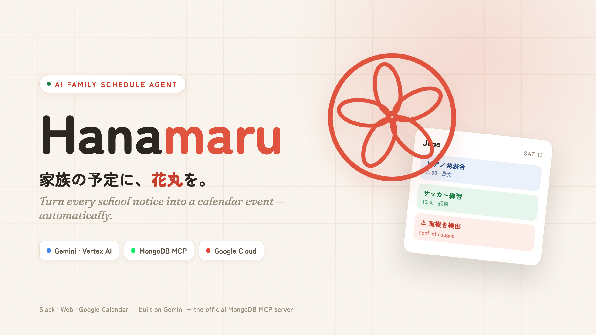

# Hanamaru 🌸



AI scheduling agent that watches Slack and writes Google Calendar entries for the family.

## What it does

Post a photo of your kid's school newsletter to a Slack channel. Hanamaru reads it (text + image),
extracts the events, and writes them to the right Google Calendar — one per child. High-confidence
extractions go straight to the calendar; ambiguous ones ask for your confirmation in the same thread.

```
[ Slack post: photo/text ]
         │
         ▼
[ Vertex AI Gemini 2.5 Flash ]
         │
         ▼
[ Google Calendar (per child) ]
```

## Stack

- TypeScript + Hono on Cloud Run (asia-northeast1)
- Vertex AI Gemini 2.5 Flash for extraction (vision + structured output)
- Firestore for idempotency + pending confirmations + attribution hints
- Slack Events API
- Google Calendar API
- All auth via GCP ADC; only Slack & OAuth secrets in Secret Manager

## Quickstart (local dev)

```bash
pnpm install
cp .env.example .env.local && $EDITOR .env.local

# Start Firestore emulator (separate terminal)
pnpm emulator:firestore

# Dev server with hot reload
pnpm dev

# Forward to Slack via ngrok
ngrok http 8080
```

## Tests

```bash
pnpm test          # unit + integration (emulator required)
pnpm test:unit     # fast, no emulator
```

## Deployment

See `docs/operations.md` for the full runbook.

## Docs

- [Design spec](docs/superpowers/specs/2026-06-06-hanamaru-design.md)
- [Implementation plan](docs/superpowers/plans/2026-06-07-hanamaru-phase1.md)
- [Operations runbook](docs/operations.md)

## License

MIT
